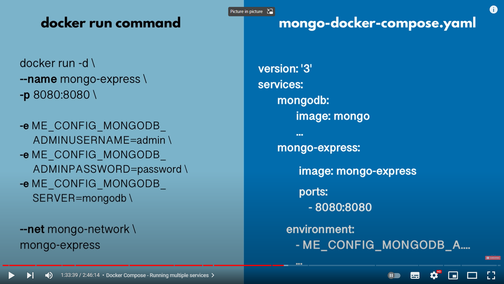

- [1. Basic Concepts](#1-basic-concepts)
- [2. How does Docker work?](#2-how-does-docker-work)
- [3. Container Port vs Host Port](#3-container-port-vs-host-port)
- [4. Docker CMD](#4-docker-cmd)
  - [`docker pull`](#docker-pull)
  - [`docker images`](#docker-images)
  - [`docker ps`](#docker-ps)
  - [`docker run`](#docker-run)
  - [`docker start {id}`](#docker-start-id)
  - [`docker stop {id}`](#docker-stop-id)
  - [`docker logs {id}`](#docker-logs-id)
  - [`docker exec -it {id} /bin/bash`](#docker-exec--it-id-binbash)
  - [`docker network ls` `docker network create {network-name}`](#docker-network-ls-docker-network-create-network-name)
  - [`docker-compose `](#docker-compose-)
- [5. Docker Network](#5-docker-network)
- [6. Docker compose](#6-docker-compose)

## 1. Basic Concepts 

**Container**: 

1. A way to package applications with all the necessary dependencies and configuration
2. Portable artifact, easily shared and moved around
3. Makes development and deployment more efficient
4. Layers of images
5. Mostly Linux Base Image, because small in size.
6. Application image on top
7. a running image on my local machine.
8. Port bound: talk to applications running inside of the container
9. virtual file system

**Container Repository**

1. Containers live.
2. Public repository `DockerHub`

**Image**

1. the actual package
2. artifact, that can be moved around

## 2. How does Docker work?

1. Docker virtualize is the application layer.
2. VM has the applications layer and its kernel.
3. Docker is much fast than VMs.

## 3. Container Port vs Host Port

- Multiple containers can run on your host machine.
- Your laptop has only certain ports available
- Conflict when the same port is on a host machine.

## 4. Docker CMD

### `docker pull`

 gets an image from DockerHub

### `docker images`

list available images on the machine

### `docker ps`

 list running containers on the machine

### `docker run`

 run an image. This will create a new container.

 - -d run an image detached
 - -p6000:6379 bind a host port to a container port
 - -name give the container a name
 - --network give it a special network
 
### `docker start {id}`

start a container with the special id. start a container.

###  `docker stop {id}`

it will stop a container with the special id.

### `docker logs {id}`

 show the logs of a container
 
### `docker exec -it {id} /bin/bash`

login the container's system 

### `docker network ls` `docker network create {network-name}`

List the networks. create a network.

### `docker-compose `

Using a YAML file to start containers 

- -f a YAML file location. 
- up. start it.
- -d detached.

## 5. Docker Network

Containers have isolated Docker Network to host 

You can deploy two or more containers in the same network.

## 6. Docker compose

using a .yaml file to run multi-containers.

- Creating a common network, so you don't specify a network.

