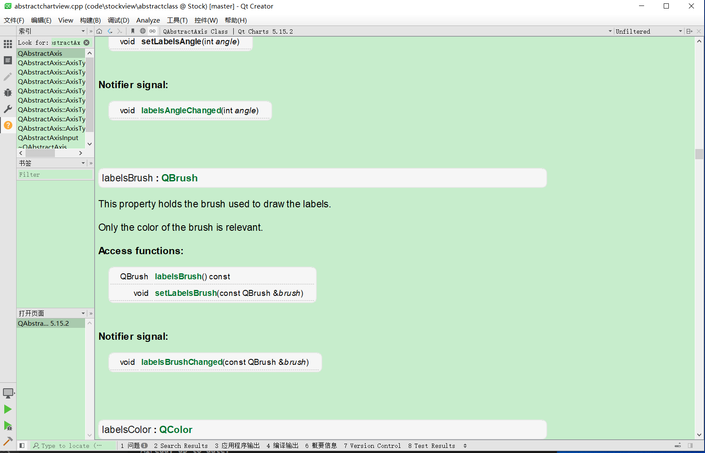
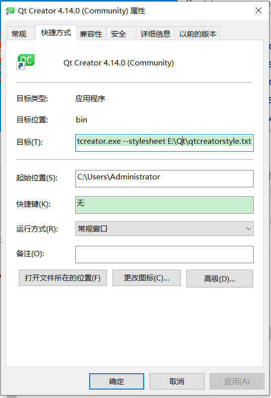

## 1. CMake的配置

使用Qt开发项目，只选择CMake，不要选择qmake。

## 2. 代码格式化方法


## 3. 代码风格和样式


## 让qtcreator变"绿"


使用qtcreator的时候，默认的帮助界面背景色是白色的，有点刺眼，为了可以看的舒服一点，把它改成绿色，下图效果。



QtCreator界面设置上没有提供改变帮助文档背景色的功能，但是可以通过命令行启动QtCreator，并同时传递参数，来设置这些。（使用Qt 的stylesheet,可以十分灵活的定制,包含字体设置等等。）

1. 在windows下使用powershell,设置永久别名。
```pwsh
PS C:\> $profile #查看profile的地址。如果没有，就新建一个。
PS C:\> New-Item -Type file -Force $profile
```
2. 编辑profile文件
```
function qt {
	 E:\Qt\Tools\QtCreator\bin\qtcreator.exe --stylesheet E:\Qt\qtcreatorstyle.txt
}
```
两个路径。一个是Qtcreator.exe的路径，一个是自定义的qss的路径。“qtcreatorstyle.txt”，完全是qss的语法。

```css
QPlainTextEdit
{
background-color: rgb(199, 237, 204);
}
QTextEdit
{
background-color: rgb(199, 237, 204);
}
```
3. 然后，重启powershell就可以键入 qt来启动QtCreator了。
4. 使用命令行还是十分方便的，如果依然想使用双击图标的方式打开QtCreator,就不需要设置上述的powershell了，直接设置QtCreator的快捷方式就可以了。





